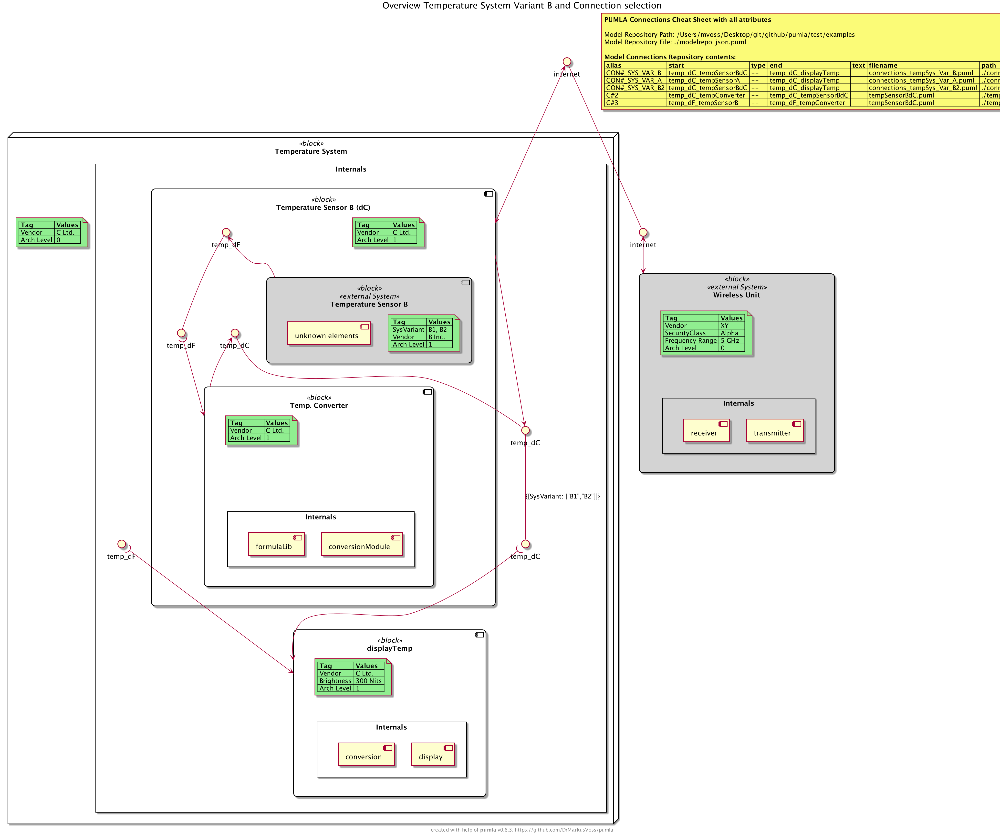

# `pumla` usage examples
These are diagrams from the `./test/examples` section. You find the
source code of the .puml files that form the example model repository
there.

## E#1: Show all Elements
[./test/examples/allElements.puml](./test/examples/allElements.puml)

## E#2: Cheat Sheet
### E#2.1: Simple Cheat Sheet
[./test/examples/cheatSheet.puml](./test/examples/cheatSheet.puml)

### E#2.2: Cheat Sheet with all attributes
[./test/examples/cheatSheetAdvanced.puml](./test/examples/cheatSheetAdvanced.puml)

## E#3: Instantiation

[./test/examples/instantiationExample.puml](./test/examples/instantiationExample.puml)

### E#3.1: `$PUMVarShowInstantiationRel = %true()`

### E#3.2: `$PUMVarShowInstantiationRel = %false()`

### E#4: Show dedicated elements, hide some unwanted internal ones
[./test/examples/easyOverviewSysVarB.puml](./test/examples/easyOverviewSysVarB.puml)

### E#5: Definition of a re-usable model element
[./test/examples/wirelessUnit/wirelessUnit.puml](./test/examples/wirelessUnit/wirelessUnit.puml)

