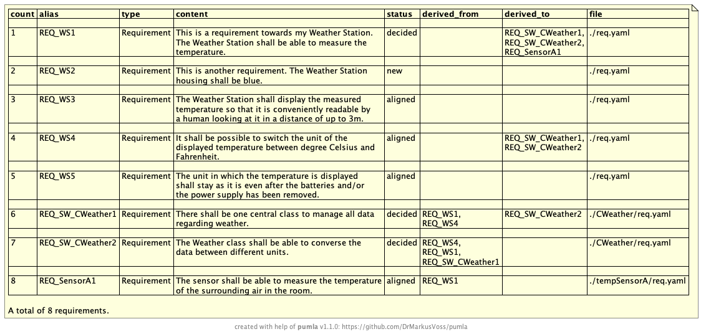

# `pumla` WeatherStation examples for requirements in docs-as-code style
These are examples from the `./test/examples/WeatherStation` section. You find the
source code of the .puml and .yaml files that form the example model repository
there. In order to get the example running on your computer, you need
to run first `pumla init`, then `pumla update`" in the examples directory, 
because the paths in the model repo file (./test/examples/WeatherStation/reqsrepo_json.puml)
need to be updated to the directory structure on your computer. Currently
the model repo file has the paths from the structure as I have it on my
machine. You can't run the pumla update from the main path of pumla, as
it is setup to update the architecture model repo of the pumla tool itself.
The examples section will be ignored from the top level. So you have to go
down to the examples and call the pumla update from that directory.

If you are changing the contents of the examples to play around, in order for a
change to become alive, you need to call `pumla update` again. cd 

## E#0: Creating Re-usable Requirements
Other than with architecture elements, in `pumla` you write the requirements in YAML and not
with PlantUML-conformant PUMLA-macros. Reason for that is, that requirements typically have
more textual relevant information and a plain table structure with potentially quite a lot
attributes that you want to have easy access on. Table-like data structures can be handled by PlantUML
with JSON representations on diagrams. But when it comes to writing the text files, YAML is easier
to use for requirements documentation than JSON. Therefore, `pumla` parses the YAML files and
puts them into the requirements repository in JSON format, so that you can put the requirements 
easily onto diagrams.

See here an example for the definition of a re-usable requirement using by describing
it in YAML:
[./test/examples/WeatherStation/req.yaml](test/examples/WeatherStation/req.yaml)

```
#PUMLARR
- type: Requirement
  alias: REQ_WS1
  status: decided
  derived_from:
  taggedvalues:
    - tag: "Vendor"
      values:
      - A Inc.
      - C Ltd.
    - tag: "Variant"
      values: [SysA, SysB]
  content:
    This is a requirement towards my Weather Station. The Weather Station shall
    be able to measure the temperature.

- type: Requirement
  alias: REQ_WS2
  status: new
  derived_from:
  content:
    This is another requirement. The Weather Station housing shall be blue.

...
```


## E#1: Show all Requirements
### E#1.1: All Requirements, full attributes, no trace
See, how all requirements are put onto a diagram using the "`PUMLAPutAllReqs()`" macro for that
purpose.

[./test/examples/WeatherStation/exampleAllReqs.puml](test/examples/WeatherStation/exampleAllReqs.puml)


### E#1.2: All requirements, brief subset of attributes, showing the trace

### E#1.3: Overview of all requirements (Cheat Sheet)
See here, how with one `pumla` macro `PUMLAPutAllReqsTable()`  and overview table is put onto
the diagram, counting the requirements and showing in which files they are implemented.

[./test/examples/WeatherStation/exampleReqCheatSheet.puml](test/examples/WeatherStation/exampleReqCheatSheet.puml)



## E#2: Put single requirements onto a diagram

## E#3: Show the requirements trace 