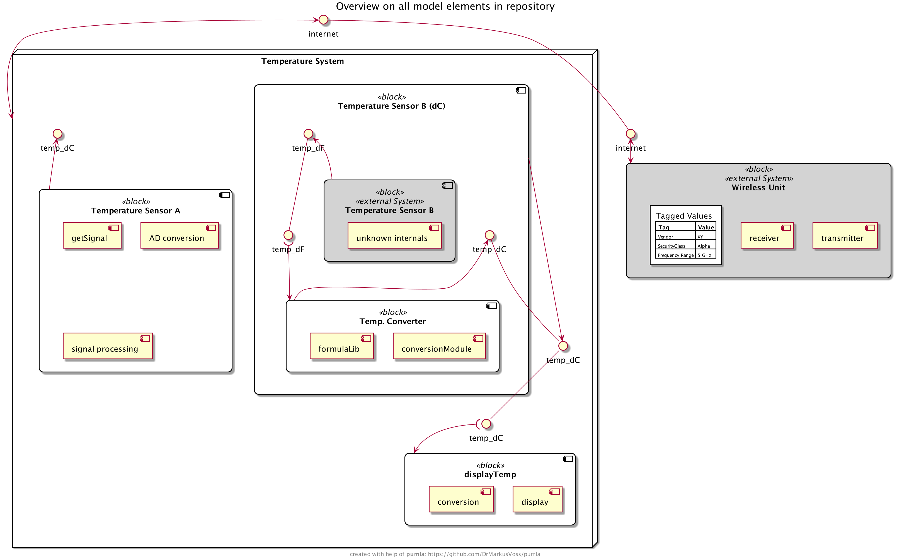

# pumla


`pumla` = PlantUML Manager, v0.8

### Idea
It seems that PlantUML is quite liked by a lot of software developers. With PlantUML they do
architecture documentation even without an architect forcing them to do. One of the reasons
for that is the text-based and code-like approach, I guess.

But PlantUML has a big drawback from my point of view (the systems and software architect point of view,
but I am also a software developer): 
with PlantUML you basically program diagrams. What the architect would like to do is to 
"draw/model/program" a system/software model with the possibility to re-use the once-modelled elements
in different views on different diagrams exposing different aspects, attributes, interactions and
relations.

So the approach with `pumla` is to dock onto the success of PlantUML but to extend it in order
to get rid of the "no re-usable model" drawback (and some other smaller drawbacks and
limitations).

Therefore, in order to enable systematic re-use for architecture models with PlantUML, 
`pumla` is intended to be an extension around PlantUML to organize and enable
this systematic re-use.

### Goals, Use Cases & Principles
- Architecture modelling of bigger software solutions using PlantUML
- Have the same model elements in different diagrams as single source entities
- Keep the architecture descriptions close to the Source Code --> Architecture as text
- Allow modularity of the architecture elements and loose coupling --> no complicated
  include mechanisms with "paths" that then make refactoring hard --> architecture modelling
  files can be everywhere in the source tree and will be found.
- enable better "bridging"/mixing of the dynamic and the static world, e.g. state or 
  sequence diagrams with deployment diagrams.
- Create an arc42 architecture documentation based on common PlantUML description patterns
  with almost no effort.

### Context Diagram
Here's an overview of the idea. It's solution is in parts still
unclear, but it evolves.

In blue you can see the parts developed as `pumla` and how they interact
with other applications and documents during software development.


---
## Getting Started

### Simple example
See this example diagram description, putting
all elements of the example model repository with stereotype "block" 
onto the diagram. Then some relations are added and unnecessary elements
removed.

[./test/examples/easyAllElementsOverview.puml](./test/examples/easyAllElementsOverview.puml)

... leading to this diagram:



### Further examples
For more examples showing off the functionality and magic of `pumla` please...

[follow this link to more examples](./Examples.md)

### Installation
- to get the latest developments, clone this git repo to a place somewhere on your Mac/Raspberry Pi or other Unix-like
system:

    ```
    git clone https://github.com/DrMarkusVoss/pumla.git
    cd pumla
    pip install .
    ```
  - after that you should be able to call `pumla <cmd>` at any place, e.g. `pumla update`.

- to get a complete and consistent set of pumla python tool, macros, examples and guidelines, download
  the latest release here:

    [pumla Releases - click here](https://github.com/DrMarkusVoss/pumla/releases)

    - In order to render the ".puml" files to diagrams, you need an installation of PlantUML, or
    you use a corresponding Plugin in your Development Environment (e.g. PlantUML integration
    for PyCharm). pumla is not triggering the render process itself, you have to do it
    manually if you have a separate PlantUML installation or the IDE Plugin will do it for you.
    
    - Add the main folder of the pumla repo to your path and make the file "pumla.py"
    executable, e.g. by typing this in your terminal (you must be in the 
    main pumla folder for this):
    - `chmod 777 pumla.py`
    - That way, it should be possible to call `pumla.py update` from
every position in your file system.

### User's Guide
You can directly dive into the details by taking a look
into the User's Guide:

[Link to User's Guide](./pumla_UsersGuide.md)

### Modelling Guideline
This guideline gives you hints and rules in order to write
`pumla` conforming PlantUML files, so that you can get the 
benefit of model element and diagram re-use:

[Link to Modelling Guideline](./ModellingGuideline.md)

### Development Environment
I use `PyCharm` as development environment for developing
`pumla` with the `PlantUML integration` plugin and the
internal bundled markdown handling activated. That way
you have fast previews of the `.puml` and markdown files.

### System Requirements
- currently `pumla` supports only Unix-like systems like Linux,
 Unix, Raspbian/Raspberry Pi OS and MacOS. I didn't do the
  file paths handling in a way that it works across Windows
  and Unix platform, as I also do not have a Windows test platform 
  at hand anymore. It is proven to run on my Macbook (Mojave)
  with Python 3.8.2 and Raspberry Pi 3 with Python 3.7.3.
- tested with PlantUML library v1.2021.7 (via the PyCharm Plugin 
  "PlantUML integration" version 5.5.1)

### `pumla` Architecture
The `pumla` Architecture is also documented using `pumla`.

Here is a first rough overview:

[Link to pumla architecture documentation](./arch/pumla_architecture.md)


### `pumla` Roadmap
See here:

[Link to pumla wiki with roadmap](https://github.com/DrMarkusVoss/pumla/wiki)

### `pumla` Test Strategy
Here is a rough description of the test strategy:

[Link to pumla test strategy document](./test/TestStrategy.md)

### Development Note
Original pumla source code developed by Dr. Markus Voss in 2021.

Original pumla repository:
https://github.com/DrMarkusVoss/pumla

Enjoy.
