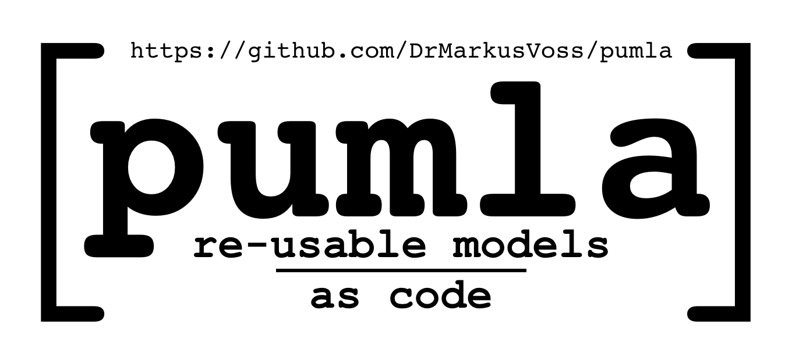
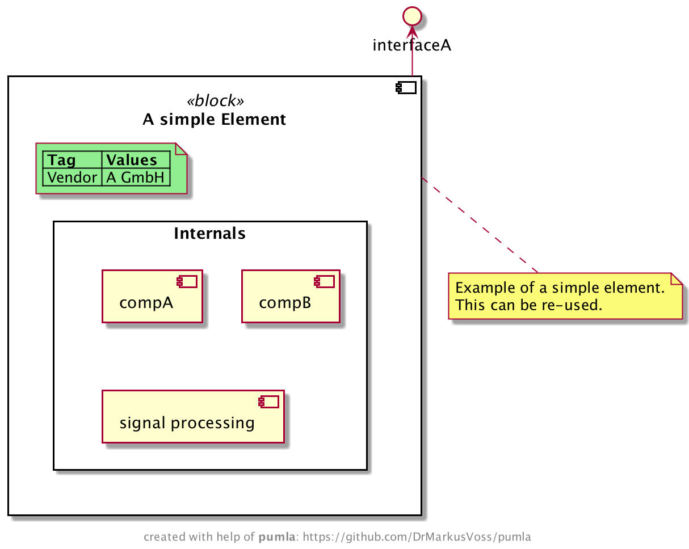
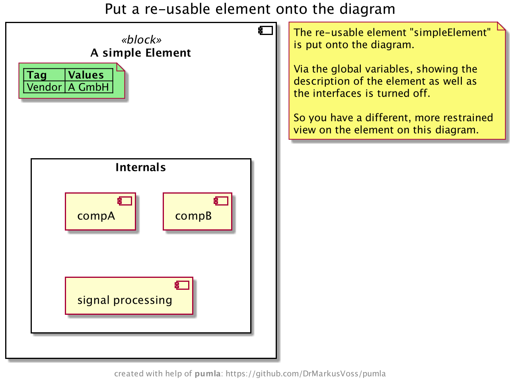

# pumla [](https://twitter.com/intent/tweet?text=pumla%20%2D%20re%2Dusable%20models%20as%20code%20&url=https://github.com/DrMarkusVoss/pumla&hashtags=uml,plantuml,softwarearchitecture,softwaredevelopment,developers)



`pumla` = PlantUML Manager

### Idea
It seems that PlantUML is quite liked by a lot of software developers. With PlantUML they do
architecture documentation even without an architect forcing them to do. One of the reasons
for that is the text-based and code-like approach, I guess.

But PlantUML has a big drawback from my point of view (the systems and software architect point of view,
but I am also a software developer): 
with PlantUML you basically program diagrams. What the architect would like to do is to 
"draw/model/program" a system/software model with the possibility to re-use the once-modelled elements
in different views on different diagrams exposing different aspects, attributes, interactions and
relations.

So the approach with `pumla` is to dock onto the success of PlantUML but to extend it in order
to get rid of the "no re-usable model" drawback (and some other smaller drawbacks and
limitations).

Therefore, in order to enable systematic re-use for architecture models with PlantUML, 
`pumla` is intended to be an extension around PlantUML to organize and enable
this systematic re-use.

### Goals, Use Cases & Principles
- Architecture modelling of bigger software solutions using PlantUML
- Have the same model elements in different diagrams as single source entities
- Keep the architecture descriptions close to the Source Code --> Architecture as text
- Allow modularity of the architecture elements and loose coupling --> no complicated
  include mechanisms with "paths" that then make refactoring hard --> architecture modelling
  files can be everywhere in the source tree and will be found.
- enable better "bridging"/mixing of the dynamic and the static world, e.g. state or 
  sequence diagrams with deployment diagrams.
- Create an arc42 architecture documentation based on common PlantUML description patterns
  with almost no effort.

### Context Diagram
Here's an overview of the idea. It's solution is in parts still
unclear, but it evolves.

In blue you can see the parts developed as `pumla` and how they interact
with other applications and documents during software development.


---
## Getting Started

### Simple example
#### Defining a re-usable element
Of course you need to have `pumla` installed. See further below for 
installation instructions.

Then:
- Create a folder for the example.
- Change into that folder. 
- Call `pumla setupprj`. That prepares your example folder as a project
  containing a pumla architecture documentation. 3 files should
have been created in the folder:  `pumla_macros.puml`,
  `pumla_blacklist.txt` and `pumla_project_config.puml`.
- Create a file like this:

File: simpleElement.puml

```PlantUML
'PUMLAMR
@startuml
!include pumla_macros.puml
!include modelrepo_json.puml

PUMLAReUsableAsset("A simple Element", simpleElement, component, "<<block>>") {
    PUMLARUAPutTaggedValues()

    PUMLARUAInternals() {
        component compA
        component "compB"
        component "signal processing"
    }
}

PUMLARUAAddTaggedValue("Vendor", "A GmbH")

PUMLARUAInterface("interfaceA", ifA_simpleELement, "out")

note as dn_simpleElement
    Example of a simple element.
    This can be re-used.
end note

PUMLARUADescr(dn_simpleElement)

PUMLAReUsableAssetFinalize()
@enduml
```
After saving the file, call `pumla update`. The model repository database
got created in a file called `modelrepo_json.puml`. The model repo
contains the "simpleElement" that you created. So this can now easily
be re-used on other diagrams, see next step.

If you are using a PlantUML plugin in your editor, you directly see
the code of the file rendered to a diagram like this:




#### Re-using the element on another diagram
Create a PlantUML diagram like this: 

File: simpleDiagram.puml

```PlantUML
@startuml
!include pumla_macros.puml
!include modelrepo_json.puml

!$PUMVarShowDescr = %false()
!$PUMVarShowInterfaces = %false()
!$PUMVarShowBodyInternals = %true()
!$PUMVarShowTaggedValues = %true()

title Put a re-usable element onto the diagram

' put the "simpleElement" from the model repository
' onto the diagram
PUMLAPutElement(simpleElement)

note as n1
    The re-usable element "simpleElement"
    is put onto the diagram.
    
    Via the global variables, showing the
    description of the element as well as
    the interfaces is turned off.
    
    So you have a different, more restrained
    view on the element on this diagram.
end note

@enduml
```
This works out of the box, as everything the diagram needs is already
there, the `pumla_macros.puml` as well as the model repo containing the
"simpleElement".

Again, in your editor with PlantUML plugin or when rendering the file 
explicitly with PlantUML, your diagram looks like this:




### Further examples
For more examples showing off the functionality and magic of `pumla` please...

[follow this link to more examples](./Examples.md)

### Installation
#### Install latest development
To get the latest developments, clone this git repo to a place somewhere on your Mac/Raspberry Pi or other Unix-like
system:

    git clone https://github.com/DrMarkusVoss/pumla.git
    cd pumla
    pip install -e .
    pumla setup

After that you should be able to call `pumla <cmd>` at any place, e.g. `pumla init` or `pumla update`. 

#### Install an official release
The following instructions work only for release equal to or newer than 0.8.3. For installation of
older releases, please read the installation instructions in the README.md of the
downloaded archive.

To get a release, do the following: 

- go to the Release page, choose a release version and download the
corresponding Source Code archive (.zip or .tar.gz).
- extract the archive
- change to the unpacked pumla folder, e.g. `cd pumla-0.8.3`
- install pumla with: `pip install .`
- call from same folder: `pumla setup`

### Working with the examples
In order to play around with the examples, you need to initialise the examples repository
  to work on your system. To do that, take the following steps starting in the pumla
package root directory (after following the installation steps, you are already there):
  ```
  cd test/examples/
  pumla init
  pumla update
  ```
The "init" step creates or updates the file "pumla_macros.puml", that connects your repo
with the pumla installation/deployment on your computer. This step must only be executed 
once after a checkout/clone.
  
The "update" step creates or updates the modelrepo_json.puml with the current content of
the examples repository and also considers the file structure/paths on your computer. This
step needs to be executed everytime you changed something on the model repository, e.g.
added a new re-usable architecture model element or changed an existing one.


### User's Guide
You can directly dive into the details by taking a look
into the User's Guide:

[Link to User's Guide](./pumla_UsersGuide.md)

### Modelling Guideline
This guideline gives you hints and rules in order to write
`pumla` conforming PlantUML files, so that you can get the 
benefit of model element and diagram re-use:

[Link to Modelling Guideline](./ModellingGuideline.md)

### Development Environment
I use `PyCharm` as development environment for developing
`pumla` with the `PlantUML integration` plugin and the
internal bundled markdown handling activated. That way
you have fast previews of the `.puml` and markdown files.

### System Requirements
- currently `pumla` supports only Unix-like systems like Linux,
 Unix, Raspbian/Raspberry Pi OS and MacOS. I didn't do the
  file paths handling in a way that it works across Windows
  and Unix platform, as I also do not have a Windows test platform 
  at hand anymore. It is proven to run on my Macbook (Mojave)
  with Python 3.8.2 and Raspberry Pi 3 with Python 3.7.3 and pip3.
- tested with PlantUML library v1.2021.7 (via the PyCharm Plugin 
  "PlantUML integration" version 5.5.1)

### `pumla` Architecture
The `pumla` Architecture is also documented using `pumla`.

Here is a first rough overview:

[Link to pumla architecture documentation](./arch/pumla_architecture.md)


### `pumla` Roadmap
See here:

[Link to pumla wiki with roadmap](https://github.com/DrMarkusVoss/pumla/wiki)

### `pumla` Test Strategy
Here is a rough description of the test strategy:

[Link to pumla test strategy document](./test/TestStrategy.md)

### Development Note
Original pumla source code developed by Dr. Markus Voss in 2021.

Original pumla repository:
https://github.com/DrMarkusVoss/pumla

Enjoy.
