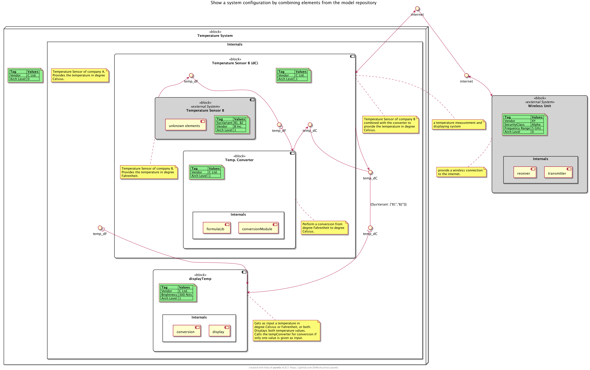

# pumla
`pumla` = PlantUML Manager, v0.5

### Idea
It seems that PlantUML is quite liked by a lot of software developers. With PlantUML they do
architecture documentation even without an architect forcing them to do. One of the reasons
for that is the text-based and code-like approach, I guess.

But PlantUML has a big drawback from my point of view (the systems and software architect point of view,
but I am also a software developer): 
with PlantUML you basically program diagrams. What the architect would like to do is to 
"draw/model/program" a system/software model with the possibility to re-use the once-modelled elements
in different views on different diagrams exposing different aspects, attributes, interactions and
relations.

So the approach with `pumla` is to dock onto the success of PlantUML but to extend it in order
to get rid of the "no re-usable model" drawback (and some other smaller drawbacks and
limitations).

Therefore, in order to enable systematic re-use for architecture models with PlantUML, 
`pumla` is intended to be an extension around PlantUML to organize and enable
this systematic re-use.

### Goals, Use Cases & Principles
- Architecture modelling of bigger software solutions using PlantUML
- Have the same model elements in different diagrams as single source entities
- Keep the architecture descriptions close to the Source Code --> Architecture as text
- Allow modularity of the architecture elements and loose coupling --> no complicated
  include mechanisms with "paths" that then make refactoring hard --> architecture modelling
  files can be everywhere in the source tree and will be found.
- enable better "bridging"/mixing of the dynamic and the static world, e.g. state or 
  sequence diagrams with deployment diagrams.
- Create an arc42 architecture documentation based on common PlantUML description patterns
  with almost no effort.

### Context Diagram
Here's an overview of the idea. It's solution is in parts still
unclear, but it evolves.

In blue you can see the parts developed as `pumla` and how they interact
with other applications and documents during software development.

---
## Getting Started

### Simple example
See this example diagram description, putting
all elements of the example model repository with stereotype "block" 
onto the diagram. Then some relations are added and unnecessary elements
removed.

[./test/examples/easyAllElementsOverview.puml](./test/examples/easyAllElementsOverview.puml)

... leading to this diagram:

### Further examples
For more examples showing off the functionality and magic of `pumla` please...

[follow this link to more examples](./Examples.md)

### User's Guide
You can directly dive into the details by taking a look
into the User's Guide:

[Link to User's Guide](./pumla_UsersGuide.md)

### Modelling Guideline
This guideline gives you hints and rules in order to write
`pumla` conformant PlantUML files, so that you can get the 
benefit of model element and diagram re-use:

[Link to Modelling Guideline](./ModellingGuideline.md)

### Development Environment
I use `PyCharm` as development environment for developing
`pumla` with the `PlantUML integration` plugin and the
internal bundled markdown handling activated. That way
you have fast previews of the `.puml` and markdown files.

### System Requirements
- currently `pumla` works only on Unix-like systems like Linux,
 Unix, Raspbian/Raspberry Pi OS and MacOS (I didn't do the
  file paths handling in a way that it works across Windows
  and Unix platform. It is proven to run on my Macbook (Catalina)
  with Python 3.8.2  and Raspberry Pi 3 with Python 3.7.3.

### `pumla` Architecture
The `pumla` Architecture is also documented using `pumla`.

Here is a first rough overview:

[Link to pumla architecture documentation](./arch/pumla_architecture.md)

### `pumla` Roadmap
See here:

[Link to pumla wiki with roadmap](https://github.com/DrMarkusVoss/pumla/wiki)
