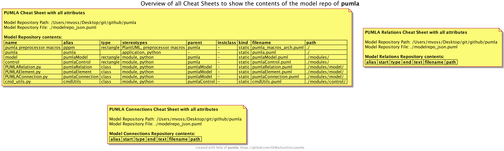

# `pumla` Architecture

## Design Principles

- **Keep `pumla` as an extension of PlantUML, do not invent 
  a separate language and generate PlantUML code.**
  - **Rationale:** When inventing a separate language and 
    then processing it to generate PlantUML code, then
    in order to make use of each PlantUML feature it would
    need to be added to the separate language first. Without
    a separate language, but with using PlantUML and only its
    preprocessor, automatically all features of PlantUML can be
    used, no extra effort needed. `pumla` just adds some
    additional capabilities.
  - **Implementation:** Still, just the preprocessor without any
    other extension was not sufficient for the re-use Use Case,
    therefore, an additional python command line tool was needed,
    but it does not introduce a new language but just gathers 
    necessary (but still PlantUML conformant coded) information
    in another PlantUML-conformant and readable representation
    (global variables in JSON format).

## Context

## Command line tool `pumla.py`

### Cheat Sheets

### All Elements

### Internal Static Structure 

