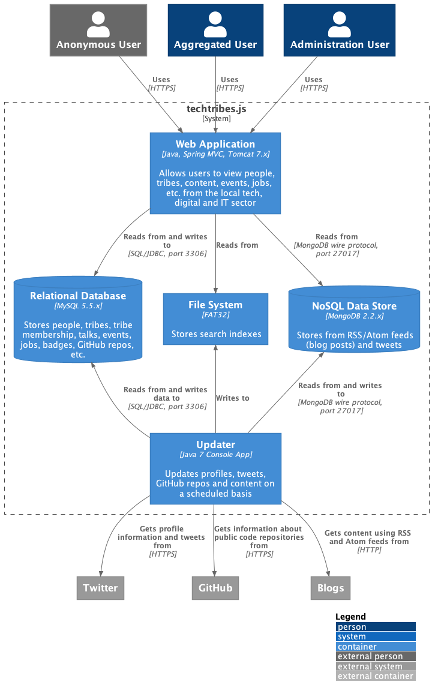
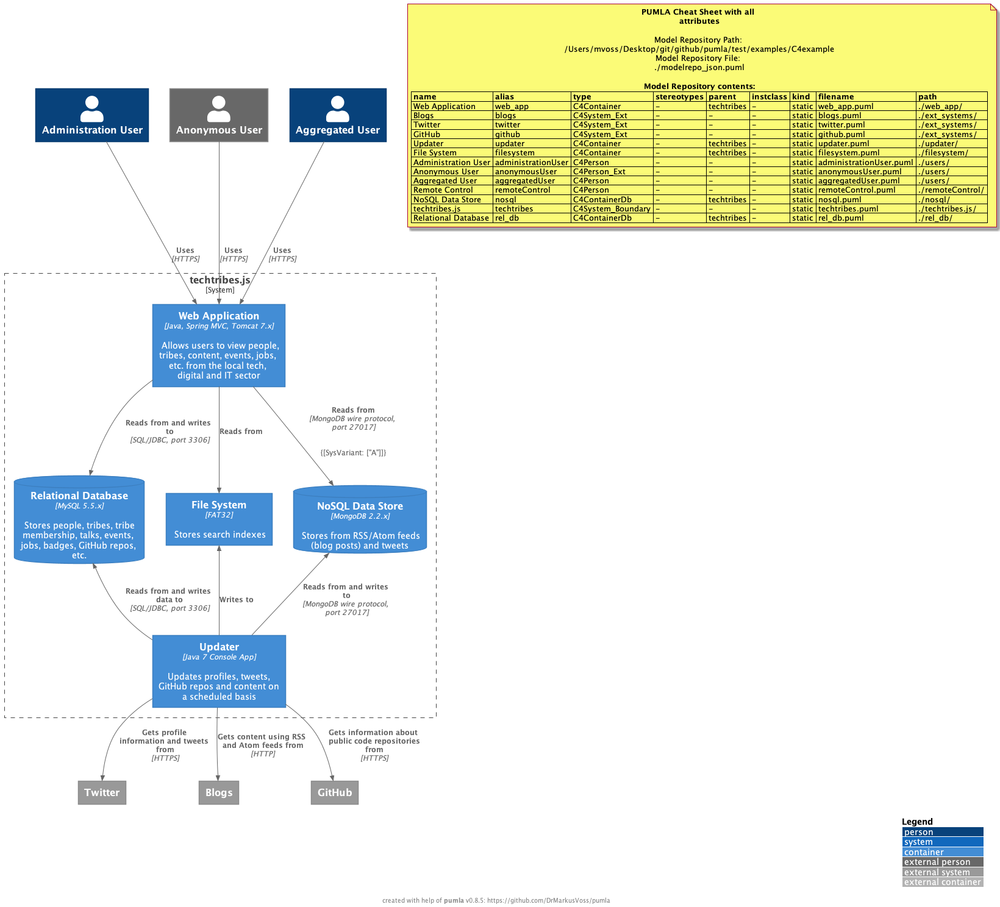

# Example for re-using C4 model elements

The following advanced example is a reproduction of an older example from the official [C4 model examples](https://c4model.com/#examples) created by [Simon Brown](https://simonbrown.je/)
(it is not there anymore, but similar ones).

The example uses **pumla** and C4-PlantUML and creates the C4 elements in a re-usable way.

### C4-PlantUML version of the example

Here you can see the reproduction of [C4-PlantUML](https://github.com/plantuml-stdlib/C4-PlantUML) of that example:

[C4-PlantUML Example Source](https://github.com/plantuml-stdlib/C4-PlantUML/blob/master/samples/C4_Container%20Diagram%20Sample%20-%20techtribesjs.puml)

And here is how it looks like:



### pumla C4 version of the example

And now here is the example coded in a re-usable manner with **pumla**:

[pumla C4 Example Source Folder](https://github.com/DrMarkusVoss/pumla/tree/main/test/examples/C4example)

[pumla C4 example diagram Source](pumlaC4ExampleDiagram.puml)

And here is how it looks like:



As you can see, there is no real difference in the diagram itself. The
re-use had no impact on the layout. The only difference is, that I put the
CheatSheet onto the diagram in addition, so that you can see how the C4
model elements are stored in the pumla model repository.

In order to make this example also work on your computer, you need to go
to the example folder (`<pumla_root>/test/examples/C4example`) and then 
call the following:
```
pumla init
pumla update
```

### How the pumla C4 example has been modeled
Now, the core of the diagram is the "system" called `techtribes.js`. The 
system boundary is modeled in a separate folder as a re-usable element.
Remember, we shall only have one re-usable element per file
([Modelling Guideline](./../../../ModellingGuideline.md)). The `techtribes`
element includes into its internals all possible children using the 
powerful `PUMLAInjectChildElements(...)` macro. That way, all elements calling
`techtribes` their parent are included into the techtribes system boundary,
which is a `C4 System_Boundary`, made re-usable by **pumla**.

The elements that are part of the `techtribes` system (everything inside the
system boundary) are also modelled as separate files in separate folders:
- `web_app`
- `filesystem`
- `rel_db`
- `updater`
- `nosql`

Within the definition of these re-usable elements, they all call the `techtribes`
element their parent, using the corresponding **pumla** file marking
(`PUMLAPARENT: techtribes`).

The users are all modelled in the same `users` folder, each in their own file. Same
for the external systems (twitter, blogs, github), they are modelled in
their own folder `ext_systems`, each in their own file.

The relations are split up. The overall relations connecting the outside
of the system with the system itself are modelled here in this file:

[./relations_overall_system.puml](relations_overall_system.puml)

It contains the relations from the users to the system and from the system
to the external systems.

The relations that combine the different "child" elements of the `techtribes`
system are stored in the `techtribes.js` folder, sorted in two files. One 
contains the relations starting at the `web_app` element 

[./techtribes.js/relations_web_app.puml](techtribes.js/relations_web_app.puml)

In this file you can also see, that I added a tag/value to one of the relations.
You can apply the pumla tagged values also to each C4 element and use
the powerful macros to select elements depending on specific tag/value 
combinations. In addition, you can still use the C4-PlantUML tag/value mechanism,
but they are only there for visualization and you cannot use them e.g. for
filtering.

The relations starting at the `updater` element are stored in this file:

[./techtribes.js/relations_updater.puml](techtribes.js/relations_updater.puml)

That makes the example complete.

For the resulting diagram in this file...

[pumla C4 example diagram Source](pumlaC4ExampleDiagram.puml)

... first the users are added one by one. Then the `techtribes` system 
element is added, and with that one, all it's children are also included.
So the elements inside the `techtribes` element must not be put onto
the diagram explicitly. Then the external systems are added one by one
(twitter, github, blogs). After that the relations are added. You could
add the relations one by one referencing them by their alias/ID, but I 
made a shortcut and just added all relations in one macro call
(`PUMLAPutAllRelations`), as there were no relations defined that I don't
want to see on the diagram. 

After that, just the CheatSheet was added and a C4 layout call (taken over
from the original C4-PlantUML example) is there.
