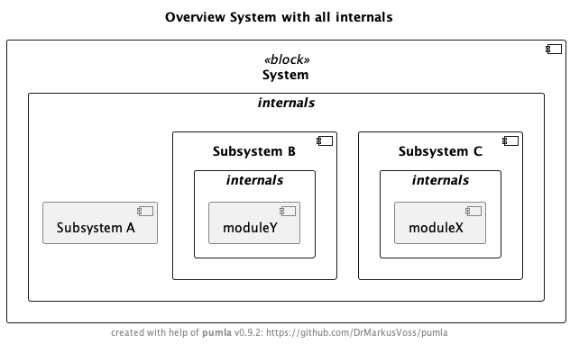
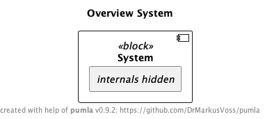
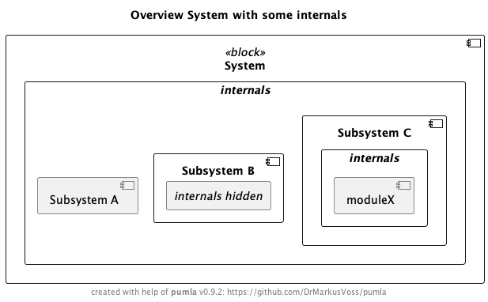

# Simple Hierarchical System
The following example can be found here:
[pumla Simple Hierarchical Example Folder](https://github.com/DrMarkusVoss/pumla/tree/main/test/simple/hierarchicalSystem).

The following elements are embedded into the element [`system`](system.puml), as all these elements define `system` as their parent
(see file markings), 
and the `system`elements opens the door for its children by calling the macro `PUMLAInjectChildElements`:
- [`subsystemA`](subsystemA.puml)
- [`subsystemB`](subsystemB.puml)
- [`subsystemC`](subsystemC.puml)

`subsystemB` and `subsystemC`themselves have other embedded elements internally.

When you now create a simple diagram and just put the `system` element on it, like in this piece of pumla code

[`sysArch_with_all_internals.puml`](sysArch_with_all_internals.puml)

that results in the following diagram:

Per default, in this project configuration, the global variable `$PUMVarShowBodyInternals` is set to true (as it is not
re-defined in the [`pumla_project_config`](pumla_project_config.puml) of this example). Therefore, aall the internals of 
the system and also its subsystems are shown.

If you want to just have the one element, without its internals, on the diagram, you can switch off showing the internals
by setting the global variable `$PUMVarShowBodyInternals` to false, as done in this diagram code

[`sysArch_overview_no_internals.puml`](sysArch_overview_no_internals.puml)

which results in this diagram:

Now, if you want to see only some internals, you can use a pumla macro to hide the internals of dedicated elements, like 
done in this pumla diagram code:

[`sysArch_with_some_internals.puml`](sysArch_with_some_internals.puml)

resulting in this diagram, where `subsystemA`does not have internals, the internals of `subsystemB` are explicitly hidden
 and the internals of `subsystemC` are shown as per default:

